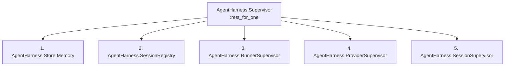
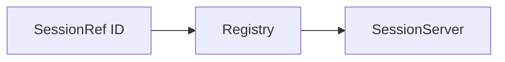

# Architecture and concurrency

AgentHarness models coding-agent conversations as OTP processes. Its goal is
to make lifecycle, interaction, and streaming predictable without pretending
stateful agent sessions are interchangeable pooled workers.

## Supervision tree

The application starts:



Responsibilities:

- **Store.Memory** owns default ephemeral snapshots and event journals.
- **SessionRegistry** maps stable session IDs to live SessionServer PIDs.
- **RunnerSupervisor** owns bounded provider-open, turn-admission,
  stream-consumer, and provider-close tasks.
- **ProviderSupervisor** dynamically supervises provider runtime processes.
- **SessionSupervisor** dynamically supervises logical SessionServers.

The root uses `:rest_for_one` because downstream sessions must not continue
against a newly empty Memory Store or Registry after one of those foundational
processes fails.

The dependency order is also the shutdown order in reverse: SessionServers
close and checkpoint before provider and task infrastructure is removed.

Session and provider children are currently temporary. Supervision supplies
ownership, isolation, shutdown, and cleanup, but v0.x does not automatically
restart and rehydrate a crashed coding session.

## One session, one conversation

`start_session/2` creates one SessionServer with:

- one stable AgentHarness session ID;
- one provider and provider session/thread ID;
- one working directory and immutable session configuration;
- at most one active turn;
- pending requests;
- event sequence and subscription state;
- a provider runtime handle.

The public `%AgentHarness.SessionRef{}` contains no PID. Calls resolve it through
the Registry:



Provider adapters receive an authenticated sink containing the SessionServer
PID and a private reference. The SessionServer ignores events bearing an old
sink reference or a noncurrent turn ID, preventing a replaced or delayed
provider runtime from corrupting current state.

## Provider runtime ownership

Provider adapters hide their concrete process model:

- Codex uses an app-server connection and a thread.
- Claude uses a bidirectional CLI session plus a temporary task that consumes
  each turn's stream.

Provider runtimes live under `ProviderSupervisor`; temporary provider-open,
startup-finalization/rollback, turn-admission, response/cancellation,
stream-consumer, and bounded-close tasks live under `RunnerSupervisor`. The
logical SessionServer does not execute a blocking CLI read in its own callbacks.

Provider stream readers send normalized messages through
`AgentHarness.Provider.Sink`. SessionServer assigns the final event sequence,
persists the event, updates its replay buffer, and delivers it to subscribers.

## Concurrency and capacity

Within one session, command admission and state transitions are serialized by a
GenServer, and only one turn may be active. Bounded provider callbacks may
overlap—for example, cancellation can race an in-flight response—so provider
adapters must rely on their transport's own serialization where required.

Across sessions, turns are independent:

```elixir
sessions
|> Task.async_stream(
  fn session ->
    with {:ok, turn} <- AgentHarness.start_turn(session, "Run the assigned work") do
      AgentHarness.await(turn, timeout: 600_000)
    end
  end,
  max_concurrency: 8,
  timeout: :infinity
)
|> Enum.to_list()
```

The `max_concurrency` above is caller policy. Without it, starting turns on
many sessions asks all providers to run concurrently.

Sessions are stateful identities rather than fungible workers, so capacity is
an admission-control concern rather than a checkout pool. Set `max_sessions`,
`max_provider_processes`, and `max_runner_tasks` in application configuration,
or apply a workload limit in the calling scheduler. The supervisor settings
default to `:infinity`.

Choose limits using:

- provider plan and rate limits;
- process memory and file descriptors;
- command and MCP subprocesses;
- model/subagent fan-out inside each CLI;
- repository size and filesystem activity;
- network and CPU capacity.

Provider rate limits and resource failures surface as provider events or
terminal failures.

Session and built-in provider startup handshakes run after child initialization
in independently supervised tasks or continuations. One slow CLI therefore
does not hold either DynamicSupervisor's start loop. `start_session/2` still
waits for its own provider to become ready before returning; call it from a
startup task when the orchestrator itself must stay responsive.

## Logical sessions versus resident CLIs

In the current v0.x implementation, `start_session/2` opens the provider runtime
immediately. Creating 1,000 sessions can therefore create a very large number
of resident CLI/app-server processes even if they have no active turn.

The BEAM can hold 1,000 lightweight GenServers comfortably; 1,000 coding-agent
CLI trees are a different resource problem. Each CLI may start commands, MCP
servers, language servers, hooks, or subagents.

For large orchestration workloads today:

- create sessions when work is ready;
- stop idle sessions once their next-step latency no longer matters;
- retain provider session IDs in Store and resume explicitly later;
- bound caller-side turn startup with `Task.async_stream/3`, Broadway, Oban, or
  your own job coordinator;
- group work into fewer conversational sessions when that preserves intent;
- monitor OS resources and provider rate-limit events.

Future passivation or admission-control components can be added without
changing public SessionRef/Turn IDs, but they are not part of v0.x.

The default Memory Store is another large-fleet limit. It serializes all Store
operations through one process and keeps full event history until an aggregate
is deleted. A live SessionServer keeps active state plus a bounded FIFO of
completed turns, terminal events, and requests; `completed_turn_cache_size`
defaults to `event_buffer_size`. The bound is an object count, not a byte bound,
and raw provider payloads can be large. For a 1,000-session orchestrator, use a
durable/partitioned Store, expire or compact high-volume deltas, stop idle
provider runtimes, and put admission control in the caller. The built-in Memory
Store is deliberately a development and ephemeral default, not a retention
policy for that scale.

## Workspace concurrency

AgentHarness does not lock working directories. Two sessions pointed at the
same writable checkout can modify the same files concurrently, run conflicting
commands, or observe half-completed changes.

The orchestrator should choose a policy:

- only one writable turn per checkout;
- one Git worktree per session/task;
- isolated containers or sandboxes;
- explicitly read-only concurrent sessions.

This matters well before BEAM process limits.

## Event and subscriber concurrency

Provider readers continuously drain CLI output into the SessionServer mailbox.
The SessionServer delivers live events with ordinary `send/2`; it does not wait
for subscriber acknowledgement.

Consequences:

- provider output is not blocked by a slow consumer;
- ordering is preserved per session;
- subscribers need their own backpressure/buffering policy;
- high-frequency deltas can grow a slow subscriber's mailbox.

Use a dedicated process to coalesce deltas before forwarding them to LiveView,
PubSub, a database, or another slower system. Semantic events—requests,
responses, tool completion, usage, and terminal events—should not be discarded.

## Failure semantics

AgentHarness favors explicit uncertainty over false success:

- a provider terminal message marks successful or failed completion;
- a missing terminal record is a failure;
- a provider runner crash fails the active turn and tears down that provider
  transport rather than risking reuse while an upstream turn may still run;
- a turn-admission timeout, callback crash, or adapter-reported uncertain start
  emits `:turn_failed`, closes the provider, and terminates the SessionServer;
  subscribers see the terminal event followed by their session monitor going
  down;
- a definite response rejection leaves its request pending for an explicit
  retry, while an uncertain response or cancellation retires the session;
- transport loss makes the session unavailable;
- Store write failure follows the configured policy: `:degrade` publishes a
  clearly non-durable `:store_failed` event and continues live-only, while
  `:stop` terminates with a structured Store failure;
- cancellation acceptance is not terminal completion.

It does not automatically retry turns. Coding turns may already have modified
files or triggered external side effects before a failure. Retry policy belongs
to the orchestrator, which can inspect the workspace and stored event history.

## Custom providers

New adapters implement `AgentHarness.Provider`:

```elixir
@callback open_session(SessionConfig.t(), Provider.Sink.t()) ::
  {:ok, handle(), session_info()} | {:error, term()}

@callback start_turn(handle(), Turn.t(), term(), keyword()) ::
  {:ok, provider_turn_ref()} | {:error, term()}

@callback respond(handle(), term(), Response.t()) ::
  :ok | {:error, term()}

@callback cancel(handle(), provider_turn_ref()) ::
  :ok | {:error, term()}

@callback close_session(handle()) :: :ok | {:error, term()}
@callback capabilities(handle()) :: Capabilities.t()
```

Use a provider module directly:

```elixir
AgentHarness.start_session(MyApp.LocalAgentProvider, cwd: "/work/project")
```

The module must be loaded and implement the provider entry points. Provider
processes should run under `AgentHarness.ProviderSupervisor`, acknowledge
commands quickly, and emit asynchronous events through the supplied Sink.

`open_session/2`, `start_turn/4`, provider commands, and `close_session/1` run
in bounded tasks tied to the SessionServer. A provider that ties its runtime to
the logical session must monitor `sink.pid`, not a callback task's `self()`. A
PID handle is monitored automatically. An opaque handle can return
`%{monitor: runtime_pid}` in `session_info`; otherwise the adapter must report
transport loss through `AgentHarness.Provider.Sink.transport_down/2`.

`capabilities/1` is the one provider callback invoked directly in a
SessionServer call. It must be an immediate, nonblocking description of the
already-open handle.

Return an ordinary `{:error, reason}` from `start_turn/4` only when the adapter
knows the provider rejected the turn before work began. If the callback cannot
determine whether upstream work started, return
`{:error, {:turn_start_uncertain, reason}}`. AgentHarness then records the
terminal failure and retires the provider session instead of exposing it as a
reusable idle conversation.

For `respond/3`, a plain `{:error, reason}` must mean the provider definitely
rejected the response; AgentHarness then releases the request claim. Return
`{:error, {:provider_command_uncertain, reason}}` when acknowledgement is
unknown. Cancellation errors are always treated conservatively because the
upstream turn may continue running.

Preserve original provider payloads in `raw`; normalize stable semantics into
AgentHarness event and request fields.

## Single-node scope

The built-in Registry, supervisors, and Memory Store are node-local. Stable IDs
make a future distributed router possible, but v0.x does not provide:

- distributed Registry ownership;
- cluster-wide capacity leases;
- remote workspace placement;
- automatic failover/resume;
- cross-node event delivery.

Add those concerns in the larger orchestrator instead of starting the same
logical session ID independently on several nodes.
