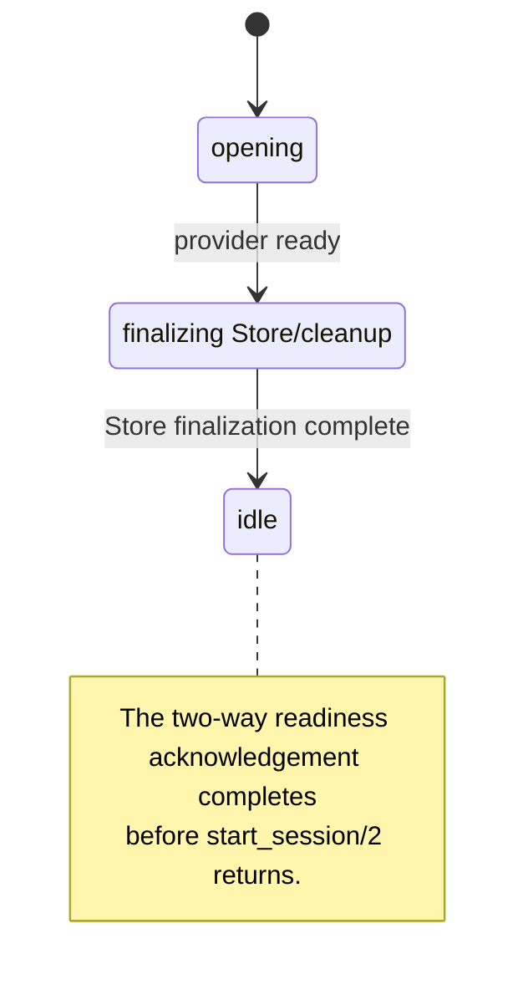
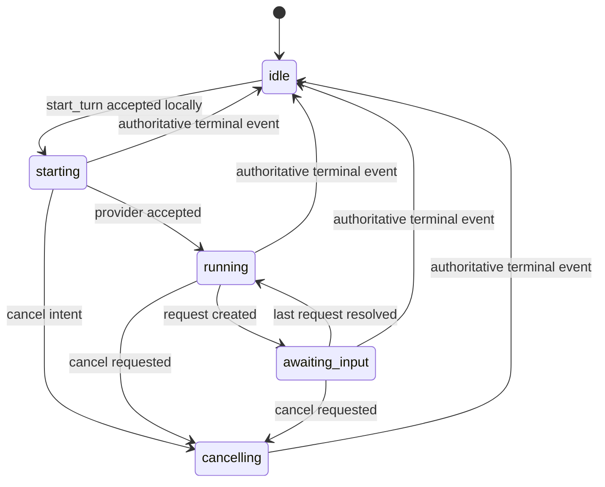

# Lifecycle, events, requests, and persistence

AgentHarness separates three concerns:

- a **session** is one provider conversation and configuration boundary;
- a **turn** is one unit of work in that conversation;
- an **event** is an ordered observation about their lifecycle.

The SessionServer is the serialization point. Provider adapters may read their
CLI streams concurrently, but every state transition, event sequence, request
response, and subscriber delivery passes through one session mailbox.

## Session and turn states

A session opens asynchronously and `start_session/2` returns only after it is
ready:



The ordinary turn lifecycle is:



The public turn handle is returned in `:starting` state before provider I/O
finishes. Provider rejection or admission timeout becomes an authoritative
`:turn_failed` event. Cancellation during `:starting` records intent and is
sent upstream as soon as the provider reference exists.

A definite provider rejection returns the session to `:idle`. An admission
timeout, provider-call timeout, or admission callback crash is uncertain
because upstream work may already have begun. AgentHarness emits the terminal
failure, closes the provider runtime, and terminates the SessionServer; a
consumer's explicit session monitor then receives `:DOWN`.

A provider transport failure emits `:transport_error`. If a turn is active, it
also fails the turn; the session then becomes `:unavailable`.

There is no implicit per-session turn queue. A non-idle session rejects another
turn with the current turn in the error tuple.

## Event envelope

Every public event is an `%AgentHarness.Event{}`:

```elixir
%AgentHarness.Event{
  schema_version: 1,
  id: "stable-generated-id",
  seq: 7,
  session_id: "session-id",
  turn_id: "turn-id",
  provider: :codex,
  type: :message_delta,
  at: ~U[2026-07-30 12:00:00Z],
  data: %{text: "Hello"},
  raw: provider_event
}
```

Properties:

- `seq` is strictly increasing within a session.
- Session events have `turn_id: nil`.
- `data` is the normalized, provider-neutral representation.
- `raw` retains the original SDK/provider value.
- `schema_version` versions the envelope, not every provider-specific payload.

The raw value is intentional. AgentHarness can normalize stable lifecycle
concepts without hiding SDK values it receives. It cannot retain a CLI wire
frame that an upstream SDK rejects before invoking the adapter; a warning from
the SDK during a live test is a compatibility signal to investigate. Code that
persists raw events should assume they can contain prompts, model output,
commands, file paths, tool input, or other sensitive data.

## Core events

The SessionServer itself emits:

| Type                | Meaning                                                           |
| ------------------- | ----------------------------------------------------------------- |
| `:session_ready`    | Session became usable after Store finalization or degradation      |
| `:session_updated`  | Provider identity or other session metadata changed               |
| `:turn_started`     | Adapter accepted the turn locally; upstream work may start lazily |
| `:request_created`  | Provider needs a question or permission response                  |
| `:request_resolved` | AgentHarness accepted one response                                |
| `:request_expired`  | Request expired at turn end, provider resolution, or timeout      |
| `:cancel_requested` | AgentHarness recorded and scheduled cancellation locally           |
| `:turn_completed`   | Authoritative successful terminal event                           |
| `:turn_failed`      | Authoritative or synthesized failure                              |
| `:turn_cancelled`   | Provider reported cancellation                                    |
| `:turn_interrupted` | Provider reported interruption                                    |
| `:transport_error`  | Provider transport became unavailable                             |
| `:store_failed`     | Store durability was lost; event itself is non-durable             |
| `:session_closed`   | AgentHarness closed the logical session                           |

Only the four `:turn_*` terminal types end `stream/2` and `await/2`.

Provider adapters also emit content and progress events. Common examples
include:

```text
:message_delta
:assistant_message
:thinking_delta
:reasoning_delta
:tool_started
:tool_progress
:tool_completed
:command_output_delta
:item_started
:item_updated
:item_completed
:usage_updated
:rate_limit
:warning
:provider_error
:provider_event
```

This vocabulary may expand as the installed CLIs and SDKs add messages. Match
the events you need and include a catch-all clause.

## Terminal events are authoritative

AgentHarness does not equate an OS process exit with successful completion.

- Codex completes from a terminal app-server turn event.
- Claude completes from a final `ResultMessage`.
- A stream that closes without its expected terminal record fails.
- A runner crash fails the active turn.
- An accepted cancellation remains nonterminal until the provider reports the
  outcome.
- An explicit forced stop records a local `:turn_interrupted` with a
  forced-stop reason. Supervisor/application shutdown records
  `:turn_interrupted` with `:session_shutdown`.

Terminal event data has this common outer form:

```elixir
%{
  status: :completed | :failed | :cancelled | :interrupted,
  result: provider_result
}
```

The nested provider result differs. Claude includes final text, usage, session
ID, stop reason, error state, and related result fields. Codex includes final
text where available, usage, thread/turn IDs, timing, and error information.

Use the outer `status` for orchestration and provider result fields for
reporting or provider-specific policy.

## Structured requests

A blocking interaction is represented by `%AgentHarness.Request{}`:

```elixir
%AgentHarness.Request{
  id: "agent-harness-request-id",
  session_id: "session-id",
  turn_id: "turn-id",
  kind: :question,
  prompt: "Which database?",
  choices: [],
  questions: [
    %{
      id: "database",
      prompt: "Which database?",
      choices: [
        %{label: "Postgres", value: "Postgres"}
      ]
    }
  ],
  schema: nil,
  metadata: %{},
  status: :pending,
  provider_ref: opaque_provider_value
}
```

Kinds currently include:

```text
:question
:command_approval
:file_change_approval
:permission
:confirmation
:mcp_elicitation
```

Questions can be singular or grouped. Build multi-question responses from
`request.questions` rather than parsing the human-readable top-level prompt.

```elixir
answers = %{
  "database" => "Postgres",
  "region" => "us-east-1"
}

AgentHarness.respond(request, AgentHarness.Response.answer(answers))
```

Other response helpers:

```elixir
AgentHarness.Response.approve()
AgentHarness.Response.approve(scope: :session)
AgentHarness.Response.deny("Policy does not allow this command")
AgentHarness.Response.cancel("Stop this operation")
```

The provider adapter validates whether a response action is meaningful for that
request. For example, question answers must include every requested answer;
approval requests accept approval/denial decisions.

`Response.approve(scope: :session)` maps to Codex's session decision for file
and structured-permission requests. Command approvals accept it only when
their `availableDecisions` advertise `acceptForSession`. Claude's current
callback adapter returns `{:error, {:unsupported_approval_scope, :session}}`.

### Exactly-once response ownership

The SessionServer owns request status. Calls to `respond/2` are serialized:

1. It finds a pending request.
2. It claims that request and starts one bounded provider callback.
3. Concurrent callers receive `{:error, :response_in_progress}`.
4. On provider acknowledgement, it records `:resolved`.
5. It persists and emits `:request_resolved`.
6. Later callers receive `{:error, :already_resolved}`.

If the provider rejects a response before accepting it, the request remains
pending and its claim is released for a deliberate retry. If acknowledgement is
uncertain, AgentHarness fails the turn and retires the session rather than
risking a duplicate response. When a turn ends, all pending requests are
persisted as expired before the terminal event is appended.

This is exactly-once ownership within one live SessionServer, not a distributed
transaction with the CLI. A process or machine failure after the provider
accepts a response but before the Store records it leaves an uncertain
outcome. A durable orchestrator should treat recovery of that case as
reconciliation, not blindly retry a side-effecting response.

Claude holds its `can_use_tool` callback while a request is pending. Its
provider-level `question_timeout` can deny a request independently of stream or
`await/2` timeouts. The timeout also expires the provider-neutral request so
the session does not remain in `:awaiting_input`.

## Event delivery and replay

Subscriptions are monitored records inside the SessionServer. Event delivery
is asynchronous:

```elixir
send(subscriber_pid, {:agent_harness, subscription.ref, event})
```

Subscriber code should:

- match the subscription reference;
- tolerate provider-specific and future event types;
- avoid long blocking work in a UI or controller process;
- unsubscribe when finished if its process stays alive.

The SessionServer monitors subscribers so it can remove dead consumers. That
does not notify a consumer when the session dies. A GenServer consumer should
also call `AgentHarness.monitor(session)` and handle the native
`{:DOWN, monitor_ref, :process, server, reason}` message. See
[Driving AgentHarness from a GenServer](genserver-integration.md).

The Store is consulted for `:start` and `{:after, seq}` replay. Turn
subscriptions pass `turn_id` into the Store query, so an indexed Store need not
copy the entire session journal. When Store is disabled or unavailable for a
read, the bounded local EventBuffer is used. A completed turn whose terminal
event is unavailable returns `{:error, :replay_unavailable}` instead of
installing a subscription that can never finish. That terminal check does not
prove every earlier nonterminal delta is still present in the bounded fallback.

There is no demand protocol between a subscriber and SessionServer in v0.1.
The provider reader is never intentionally paused because a subscriber is slow.
If token-level streams feed a slower destination, put a buffering/coalescing
consumer between AgentHarness and that destination.

## Telemetry

AgentHarness emits spans without prompts, model output, raw payloads,
environment values, or credentials:

```text
[:agent_harness, :command, :start_session, :start | :stop | :exception]
[:agent_harness, :command, :start_turn, :start | :stop | :exception]
[:agent_harness, :session, :start | :stop]
[:agent_harness, :turn, :start | :stop]
[:agent_harness, :provider, :command, :start | :stop]
[:agent_harness, :store, :write, :start | :stop | :exception]
[:agent_harness, :request, :created | :resolved | :expired]
```

The public command spans measure API call execution. Provider-command spans
measure response and cancellation callbacks separately and stop with `:ok`,
`:rejected`, `:uncertain`, or `:aborted`. The session and turn spans measure the
lifetime of a ready runtime and accepted turn respectively; their `:stop`
metadata includes the terminal status or process reason. Metadata also includes
identifiers, provider, operation, result, and request kind where applicable.
Span durations use native monotonic time units, matching Telemetry conventions.
`:start` measurements contain `system_time`; `:stop` and `:exception` spans
contain `duration`.

Attach handlers with standard Telemetry APIs:

```elixir
:telemetry.attach_many(
  "myapp-agent-harness",
  [
    [:agent_harness, :session, :stop],
    [:agent_harness, :turn, :stop],
    [:agent_harness, :provider, :command, :stop],
    [:agent_harness, :store, :write, :stop]
  ],
  &MyApp.AgentMetrics.handle_event/4,
  nil
)
```

## Default persistence

The application supervises `AgentHarness.Store.Memory`. New sessions default
to:

```elixir
store = {AgentHarness.Store.Memory, AgentHarness.Store.Memory}
```

Memory Store keeps:

- session lifecycle snapshots;
- all turn snapshots;
- all request snapshots and responses;
- the ordered event journal.

It is process-owned rather than SessionServer-owned. Stopping a session leaves
its history in Store. Purge a non-live aggregate through the guarded public
API:

```elixir
:ok = AgentHarness.purge_session(session)
```

Purging a live session returns `{:error, :session_active}`. The built-in
Memory Store applies the same guard to direct `delete_session/2` calls. Custom
Store adapters should treat direct deletion as a low-level operation and
provide equivalent protection if it is exposed elsewhere.

The data is still ephemeral. Restarting the Store/application loses it.
Memory Store is appropriate for development, tests, and same-VM event replay,
not durable audit history.

It is deliberately simple: one GenServer owns every aggregate and retains
every stored event until deletion. Its per-turn event index makes turn replay
proportional to that turn's history.

It is therefore not the production Store for hundreds or thousands of
high-volume sessions. Use a custom partitioned or database-backed Store, or
disable persistence for bounded live-only sessions.

The SessionServer's separate hot state is bounded by two controls:

- `event_buffer_size` bounds recent replay events;
- `completed_turn_cache_size` bounds completed Turn values, terminal events,
  and their requests. It defaults to `event_buffer_size`, accepts zero, and may
  be set to `:infinity` explicitly.

Active turn and pending request state is never evicted. These are object-count
bounds rather than byte bounds; event `raw` values may carry large SDK structs.
When a completed turn leaves the hot cache, a configured Store supplies cold
turn, request, and terminal-event lookups.

### Session snapshot contents

The default SessionServer snapshot contains:

```text
id
provider
status
provider_session_id
current_turn_id
cwd
model
metadata
config_fingerprint
created_at
updated_at
startup (present only while the readiness handoff is pending)
```

It does not store the full environment, MCP configuration, skills, or provider
options. The fingerprint can detect configuration drift without making those
values restorable.

AgentHarness v0.1 does not automatically recreate a stopped SessionServer from
this snapshot. Resume a provider conversation by starting a new session and
passing the saved provider session/thread ID as documented in
[Provider configuration](configuration.md).

Inventory and replacement are explicit reconciliation tools:

```elixir
live = AgentHarness.list_sessions()

{:ok, stored} = AgentHarness.list_stored_sessions()
# => [%{session_id: id, snapshot: snapshot, live?: false}, ...]

{:ok, session} =
  AgentHarness.start_session(:codex,
    id: id,
    reuse: :closed
  )
```

`reuse: :closed` destructively replaces only a cleanly closed aggregate.
`reuse: :replace` also replaces a stale non-live aggregate after a crash. Both
purge its old turns, requests, and journal only after the new provider opens
successfully. The default `reuse: :never` preserves history and returns
`:session_id_already_used`. A snapshot with a pending `startup` attempt marker
is automatically reclaimable because the caller/server readiness handoff never
completed, regardless of whether its last status write was `:finalizing` or
`:idle`. These modes do not reconstruct prior core state; pass the stored
provider session ID separately when provider conversation resume is desired.

## Disable persistence

For a purely live, bounded session:

```elixir
{:ok, session} =
  AgentHarness.start_session(:codex,
    store: false,
    event_buffer_size: 500
  )
```

With `store: false`, session state and events exist only in the SessionServer
and its two bounded caches. If a completed turn leaves the completed-turn cache
and its terminal event also leaves the event ring, `await/2`, `stream/2`, and a
turn replay from `:start` return `:replay_unavailable`. Explicit turn IDs also
fail closed after pruning because the process can no longer prove that an old
ID was never used. Increase either bound or configure a Store when longer
lookback is required.

## Custom Store adapters

A custom adapter implements `AgentHarness.Store` and is passed with an owner:

```elixir
{:ok, session} =
  AgentHarness.start_session(:codex,
    store: {MyApp.AgentStore, MyApp.AgentStore}
  )
```

The owner can be a process name, PID, repository module, or other adapter term.
The adapter is responsible for interpreting it.

This behaviour is the repository boundary: AgentHarness does not depend on
Ecto, but an application can implement the callbacks with an Ecto Repo and
tables for sessions, turns, requests, and ordered events.

The Store behaviour covers:

```text
save/fetch/list/delete session
save/fetch/list turn
append/read events and latest sequence
save/fetch/list request
```

Store writes are synchronous and consistency-critical. With the default
`store_failure: :degrade`, a failed write switches the session to live-only
mode, sets `durability: {:degraded, failure}` in `status/1`, logs the failure,
and emits a non-durable `:store_failed` event before later live events. With
`store_failure: :stop`, the SessionServer exits with a structured
`{:store_write_failed, operation, reason}` failure. A database-backed
implementation should make event append idempotent by event ID/sequence and
preserve strictly increasing per-session order.

Memory Store allows exact append retries, rejects conflicting IDs or sequences,
and permits sequence gaps so a future durable adapter can choose not to retain
every high-volume delta.

Before passing a custom Store, start it under your application's supervision
tree. AgentHarness supervises only its built-in Memory instance.
